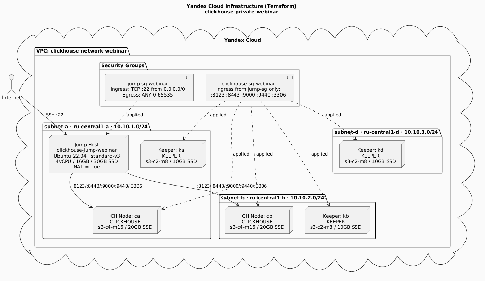
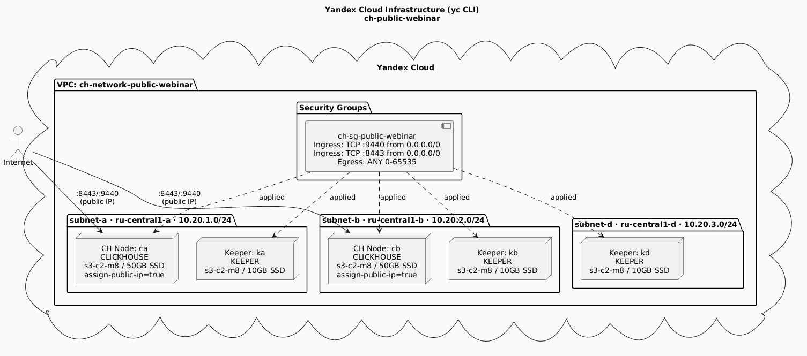

# 10 способов подключиться к Managed ClickHouse в Yandex Cloud

Материалы вебинара Yandex Cloud.

---

## Структура репозитория

```
├── terraform/              # IaC-инфраструктура: сеть, кластер, jump-хост
│   ├── main.tf
│   ├── variables.tf
│   ├── outputs.tf
│   └── terraform.tfvars    # ← создать самостоятельно
├── load_yambda.py          # Загрузка датасета
├── query_yambda.py         # Примеры запросов через clickhouse-connect
└── webinar-code.md         # Весь код вебинара по блокам
```

---

## Блок 1 — Managed ClickHouse без публичного доступа (через jump-хост)



Terraform поднимает:
- VPC-сеть с подсетями в 3 зонах доступности
- HA-кластер ClickHouse: 2 узла ClickHouse + 3 узла Keeper
- Jump-хост с публичным IP для подключения

**Способы подключения из раздела 1:**
1. `clickhouse-client` — нативный протокол, порт 9440 (TLS)
2. `curl` — HTTP-интерфейс, порт 8443 (HTTPS)
3. `mysql-client` — MySQL Wire Protocol, порт 3306 (TLS)
4. Docker + clickhouse-client
5. Python `clickhouse-connect` — порт 8443
6. Python `SQLAlchemy` + clickhouse-connect диалект

### Быстрый старт (Блок 1)

```bash
# 1. Создайте terraform/terraform.tfvars (см. раздел 1.5 в webinar-code.md)
cd terraform

# 2. Передайте токен через переменную среды (не хранить в файле)
export TF_VAR_yc_token=$(yc iam create-token)

# 3. Разверните инфраструктуру
terraform init
terraform apply

# 4. Получите адреса
export CH_HOST=$(terraform output -raw clickhouse_fqdn)
export JUMP_IP=$(terraform output -raw jump_public_ip)
```

---

## Блок 2 — Managed ClickHouse с публичным доступом




Инфраструктура создаётся через YC CLI. Кластер доступен напрямую без jump-хоста.

**Дополнительные способы подключения:**
7. DBeaver — порт 8443, SSL режим STRICT
8. Play UI — встроенный веб-интерфейс `https://<fqdn>:8443/play`

---

## Блок 3 — ClickHouse + DataLens

Загрузка датасета Yambda 50M из HuggingFace и визуализация в DataLens.

**Способы подключения:**
9. DataLens — Connection → ClickHouse
10. WebSQL (встроенный интерфейс Yandex Cloud Console)

### Загрузка датасета

```bash
python3 -m venv ~/venv/yambda
source ~/venv/yambda/bin/activate
pip install clickhouse-connect pyarrow pandas huggingface_hub tqdm

export CH_HOST="<FQDN кластера>"
export CH_USER="admin"
export CH_PASS="<пароль>"
export CA_CERT="/usr/local/share/ca-certificates/Yandex/RootCA.crt"

python3 load_yambda.py
```

---

## Справочник портов

| Протокол       | Порт | TLS | Использование                              |
|----------------|------|-----|--------------------------------------------|
| Native TCP+TLS | 9440 | да  | clickhouse-client, clickhouse-connect      |
| HTTPS          | 8443 | да  | curl, DBeaver, Play UI, DataLens           |
| MySQL+TLS      | 3306 | да  | mysql-client, MySQL-совместимые BI-клиенты |
| Native TCP     | 9000 | нет  | только внутри VPC                          |
| HTTP           | 8123 | нет  | только внутри VPC                          |

---

## Требования

- [Terraform]
- [YC CLI](https://cloud.yandex.ru/docs/cli/quickstart)
- Python 3.10+
- Аккаунт Yandex Cloud с правами на создание MDB и Compute ресурсов

## Удаление ресурсов

Не забудьте удалить все ресурсы по окончанию